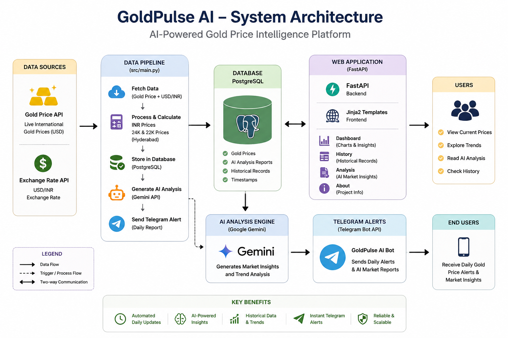
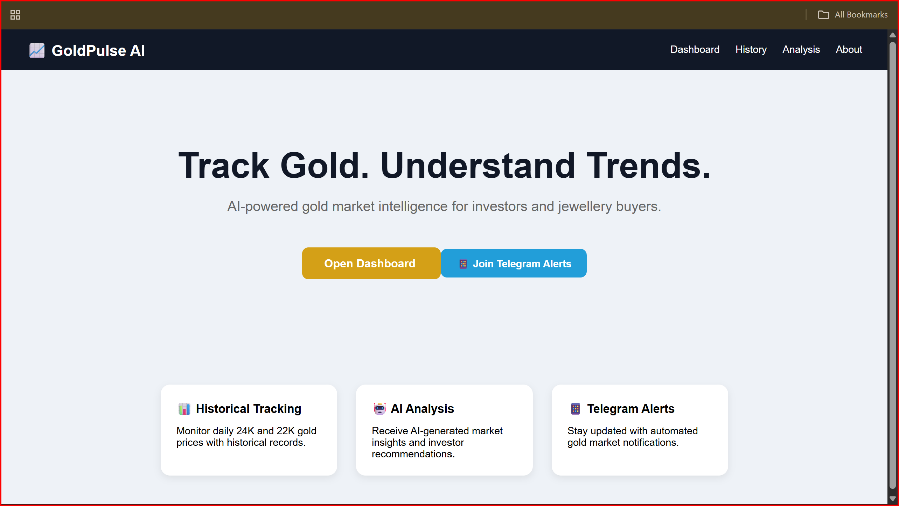
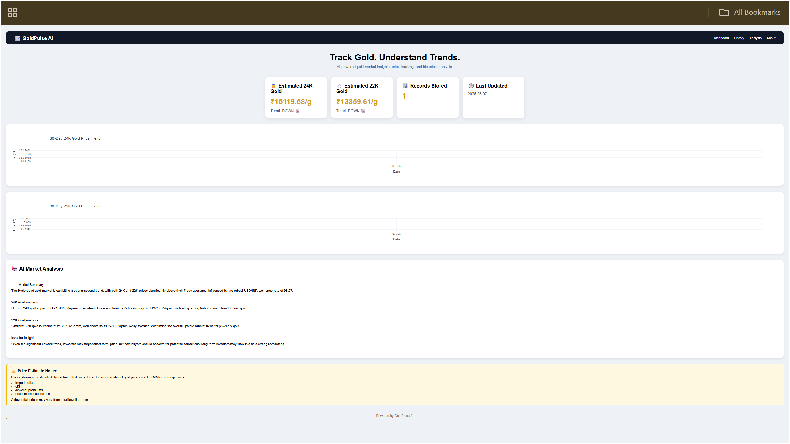
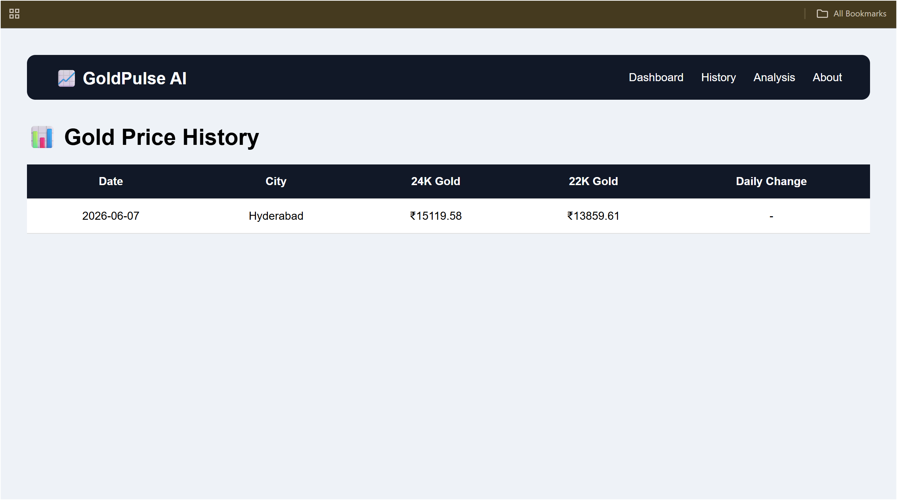
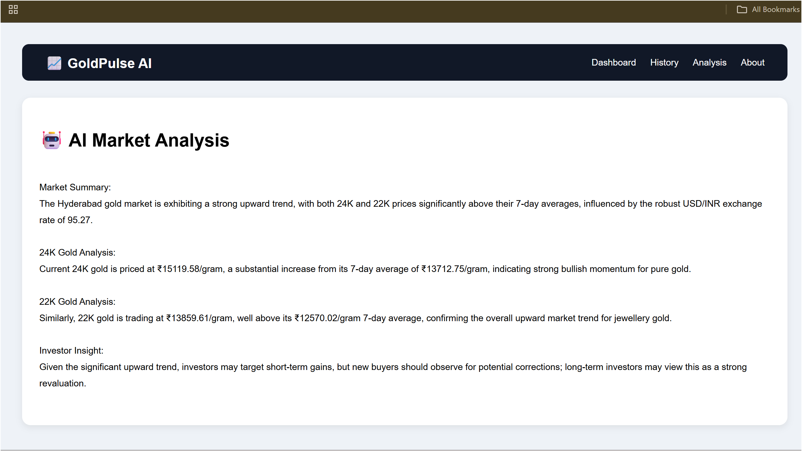

# GoldPulse AI

AI-powered gold price intelligence platform that tracks daily gold prices, generates market insights, stores historical data, provides an interactive AI assistant, and sends automated Telegram alerts.

## Live Demo

Website: https://goldpluse-ai-production.up.railway.app

Telegram Bot: https://t.me/GoldPluse_AI_bot

---

## Features

### Real-Time Gold Price Tracking

* Fetches live international gold prices
* Converts prices to INR using current USD/INR exchange rates
* Calculates estimated Hyderabad retail gold prices

### Historical Data Storage

* Stores daily gold prices in PostgreSQL
* Maintains long-term historical records
* Enables trend analysis and reporting

### AI Market Analysis

* Generates daily AI-powered market summaries
* Provides investor-focused insights
* Detects bullish and bearish market trends

### Interactive Dashboard

* Current 24K and 22K gold prices
* Historical trend visualizations
* AI-generated market reports
* Last updated timestamp

### Telegram Alerts

* Daily automated reports
* Gold price notifications
* Market trend updates

### Ask GoldPulse AI Assistant

* Real-time streaming AI responses
* RAG-powered context from historical reports
* Chat memory with session continuity
* Markdown-rendered answers

### Dark Mode

* System-wide dark theme toggle
* Persists across pages and sessions
* Smooth animated transitions

---

## Technology Stack

### Backend

* Python
* FastAPI
* SQLAlchemy

### Database

* PostgreSQL

### Frontend

* HTML
* CSS
* Jinja2 Templates
* Plotly

### AI

* Groq (LLaMA 3.1)
* Google Gemini (Embeddings)
* LangChain
* ChromaDB (RAG Vector Store)

### Deployment

* Railway

### Notifications

* Telegram Bot API

---

## Project Architecture
<p align="center">
  
</p>
```text
Gold API
    │
    ▼
Data Collection Pipeline
    │
    ▼
PostgreSQL Database
    │
    ▼
AI Analysis (Groq & Gemini)
    │
    ├── Website Dashboard
    │
    └── Telegram Alerts
```

---

## Pages

### Home
<p align="center">
  
</p>
Landing page introducing GoldPulse AI.

### Dashboard
<p align="center">
  
</p>
Displays:

* Current 24K Gold Price
* Current 22K Gold Price
* Trend Analysis
* Historical Charts
* AI Market Report

### History
<p align="center">
  
</p>
Displays complete historical gold price records.

### Analysis
<p align="center">
  
</p>
Shows detailed AI-generated market insights with structured sections:

* Macroeconomic overview
* Technical price action
* Retail & jewellery outlook
* Strategic recommendations

### Ask GoldPulse

Interactive AI chat assistant with:

* Real-time streaming responses
* RAG-powered historical context
* Session-based chat memory
* Suggested prompts for quick start

### About

Project overview, technology stack, and development timeline.

---

## Installation

### Clone Repository

```bash
git clone https://github.com/sohithchanumolu/goldpluse-ai.git
cd goldpluse-ai
```

### Create Environment

```bash
conda create -n goldpulse python=3.13
conda activate goldpulse
```

### Install Dependencies

```bash
pip install -r requirements.txt
```

### Configure Environment Variables

Create a `.env` file:

```env
DATABASE_URL=your_postgresql_url
GEMINI_API_KEY=your_gemini_api_key
GROQ_API_KEY=your_groq_api_key
TELEGRAM_BOT_TOKEN=your_bot_token
TELEGRAM_CHAT_ID=your_chat_id
```

### Run Application

```bash
uvicorn web.app:app --reload
```

Open:

```text
http://127.0.0.1:8000
```

---

## Automated Data Pipeline

Run manually:

```bash
python -m src.main
```

Or trigger:

```text
https://goldpluse-ai-production.up.railway.app/run
```

---

## Future Improvements

* Gold price forecasting
* User authentication
* Personalized watchlists
* Mobile application
* Advanced analytics dashboard
* Multi-city gold tracking
* Historical report backfill

---

## Author

Sohith Chanumolu

Built as an end-to-end AI and Data Engineering project combining:

* FastAPI
* PostgreSQL
* AI Analysis
* Data Pipelines
* Cloud Deployment
* Telegram Automation
